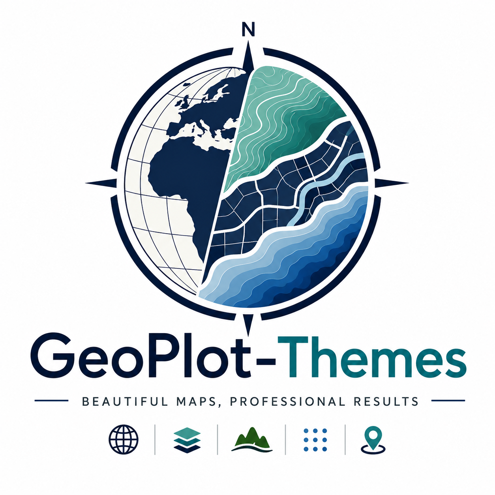
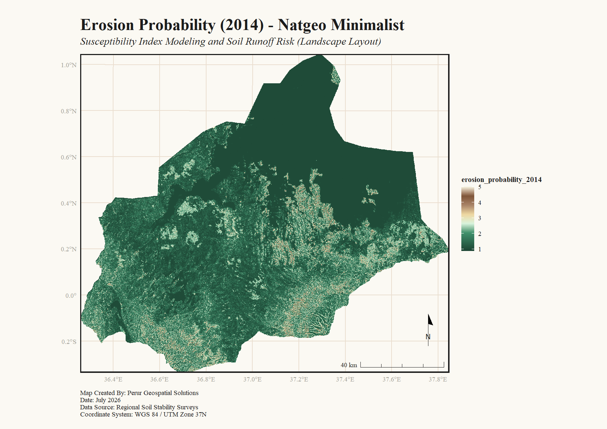
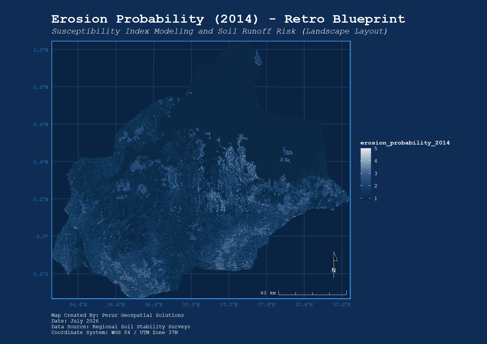
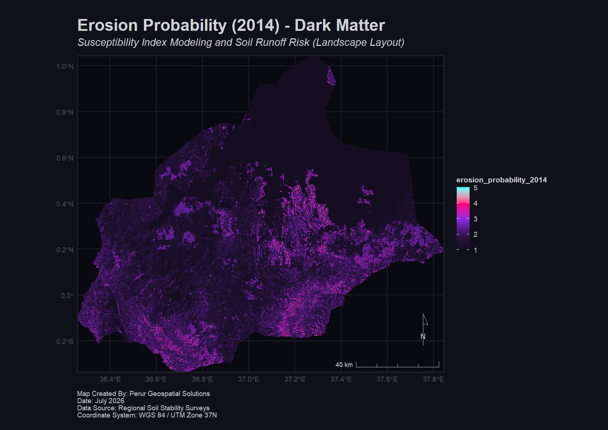
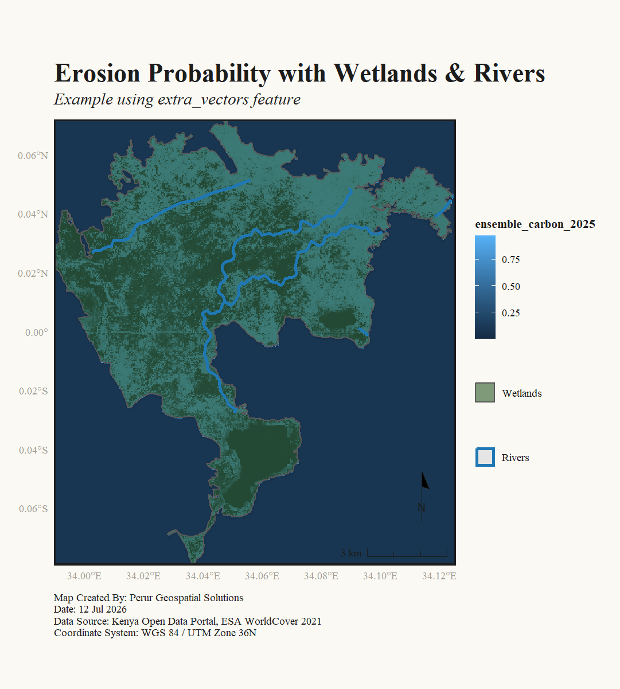

# GeoPlot-Themes 🌍🎨

<p align="center">
  
</p>

<p align="center">
  <strong>Stunning pre-designed map themes, custom geographic colormaps, and cartographic templates for Matplotlib, Seaborn, and GeoPandas.</strong>
</p>

<p align="center">
  <a href="https://pypi.org/project/geoplot-themes/"></a>
  <a href="https://pypi.org/project/geoplot-themes/"></a>
  <a href="https://opensource.org/licenses/MIT"></a>
  <a href="https://github.com/psf/black"></a>
</p>

---

`geoplot-themes` bridges the gap between Python's data processing ecosystem (`GeoPandas`, `Shapely`, `Pandas`) and R's layout rendering engine (`ggplot2`, `ggspatial`, `ggnewscale`). Create publication-quality, aesthetically gorgeous maps instantly without spent hours tweaking grid lines, legend alignment, or north arrow coordinates.

## 🌟 Visual Showcase

### Handcrafted Cartographic Themes

| `natgeo_minimalist` (Cream/Editorial) | `retro_blueprint` (Classic Technical) | `dark_matter` (Neon/Dark Mode) |
| :---: | :---: | :---: |
|  |  |  |

### Complex Vector Overlays with Independent Legends
A base raster (elevation/erosion) layered with multiple separate vector shapefiles (wetlands and rivers), featuring automatically styled, independent, conflict-free scales:
<p align="center">
  
</p>

---

## 🚀 Key Features

* **Pre-designed Themes**: Instantly switch visual aesthetics (`natgeo_minimalist`, `dark_matter`, `retro_blueprint`) without altering your plotting code.
* **Geographic Colormaps**: Built-in, science-backed palettes optimized for terrain (`elevation`), oceanography (`bathymetry`), technical grids (`blueprint`), and digital screens (`neon`).
* **Conflict-Free Legends**: Stack infinite shapefile layers (polygons, lines, points) with independent, color-coordinated legends.
* **Auto-Orientation & Fit**: Calculates data bounding boxes dynamically (`orientation="auto"`) to yield tightly cropped maps without margins or white padding.
* **Floating Inset Maps**: Sub-coordinate map inserts that automatically render a global or country-level context and draw a reference box of your zoom location.
* **Automatic Label Repulsion**: Non-overlapping text labels powered by `ggrepel` that cleanly connect text back to point coordinates.

---

## 📦 Installation

To install `geoplot-themes` with `uv` (recommended):
```bash
uv add geoplot-themes
```
Or via standard `pip`:
```bash
pip install geoplot-themes
```

---

## ⚡ Quickstart

### 1. High-Level Python Wrapper (`plot_map_r`)
The high-level R-bridge handles file input, R-script rendering, CRS projections, and outputs a high-resolution map image. It automatically detects your local R installation and downloads any missing R dependencies (`sf`, `terra`, `ggplot2`, `ggspatial`, `ggnewscale`, `ggrepel`, `patchwork`) to a local cache folder.

```python
import geoplot_themes as gpt

# Check R dependencies and install missing ones to local cache
gpt.ensure_r_packages()

# Render a professional map layout using R backend
gpt.plot_map_r(
    raster_data="digital_elevation_model.tif",
    points_data="sampling_locations.csv",
    points_color_column="pH_level",
    points_label_column="site_name",
    theme="natgeo_minimalist",
    colormap="elevation",
    title="Soil Acidity Survey",
    subtitle="Sampling locations in Central Highlands",
    output_path="maps/soil_acidity_map.png"
)
```

### 2. Matplotlib Theme Registry (Pure Python)
If you prefer to plot directly in Python using Matplotlib, Seaborn, or GeoPandas, you can use the theme registry to style global Matplotlib configurations:

```python
import geopandas as gpd
import geoplot_themes as gpt
import matplotlib.pyplot as plt

# Apply theme globally to matplotlib rcParams
gpt.set_theme("dark_matter")

# Or use as a context manager for temporary styles
with gpt.use_theme("retro_blueprint"):
    gdf = gpd.read_file("counties.shp")
    # Custom colormaps are registered globally in Matplotlib (prefixed with 'geoplot_')
    gdf.plot(cmap="geoplot_blueprint", legend=True)
    plt.title("County Boundaries")
    plt.show()
```

---

## 📖 API Parameter Reference

### `plot_map_r(...)`

| Parameter | Type | Default | Description |
| :--- | :--- | :--- | :--- |
| **`raster_data`** | `str` | `None` | Path to a base raster `.tif` file. |
| **`vector_data`** | `str` | `None` | Path to the primary vector file (`.shp` or `.geojson`). |
| **`vector_column`** | `str` | `None` | Column in `vector_data` used to color polygons/lines. |
| **`vector_discrete`** | `bool` | `False` | Set `True` if `vector_column` contains categorical data. |
| **`extra_vectors`** | `list[dict]` | `None` | Additional vector overlay list (see below). |
| **`points_data`** | `str` | `None` | Path to point `.shp`, `.geojson`, or `.csv` (requires `x`/`y` or `long`/`lat` headers). |
| **`points_color_column`** | `str` | `None` | Column in point data used to color points. |
| **`points_label_column`**| `str` | `None` | Column containing text labels. Enables smart repel lines. |
| **`points_discrete`** | `bool` | `True` | Set `True` if point color column is categorical/discrete. |
| **`theme`** | `str` | `"natgeo_minimalist"` | Core theme: `"natgeo_minimalist"`, `"dark_matter"`, or `"retro_blueprint"`. |
| **`colormap`** | `str` | `"elevation"` | Core colormap: `"elevation"`, `"bathymetry"`, `"blueprint"`, `"neon"`, or `"editorial"`. |
| **`orientation`** | `str` | `"auto"` | Canvas ratio: `"auto"` (auto-hugs data bounding box), `"portrait"`, or `"landscape"`. |
| **`title`** | `str` | `None` | Main title text. |
| **`subtitle`** | `str` | `None` | Subtitle text. |
| **`author`** | `str` | `None` | Author name printed in map caption. |
| **`date_str`** | `str` | `None` | Publication date printed in map caption. |
| **`data_source`** | `str` | `None` | Data citation source printed in map caption. |
| **`crs_text`** | `str` | `None` | CRS coordinate projection description printed in map caption. |
| **`show_coords`** | `bool` | `True` | Toggles latitude/longitude graticule lines and labels. |
| **`scale_bar`** | `bool` | `True` | Toggles dynamic distance scale bar (calculates metric or degrees). |
| **`north_arrow`** | `bool` | `True` | Toggles north compass arrow. |
| **`inset_map`** | `str` | `None` | Path to global/continental context shapefile to enable floating inset map. |
| **`inset_position`** | `list[float]` | `[0.7, 0.7]` | Bounding `[x, y]` location of inset from `0.0` to `1.0`. |
| **`inset_scale`** | `float` | `0.25` | Relative size scale of the inset map from `0.0` to `1.0`. |
| **`output_path`** | `str` | `"output_map.png"` | Destination file path to save the rendered high-resolution map. |

#### Extra Vectors Schema (`extra_vectors`)
Pass a list of dictionaries to overlay additional vector files on top of the base layers:
```python
extra_vectors = [
    {
        "data": "C:/data/swamp.shp",     # File path
        "name": "Wetlands",             # Legend title
        "fill": "#2d5a27",              # Fill color (hex)
        "color": "NA",                  # Outline color (hex)
        "alpha": 0.6,                   # Transparency (0.0 to 1.0)
        "linewidth": 0.5                # Outline width
    }
]
```

---

## 🎨 Design Reference

### Themes
* **`natgeo_minimalist`**: Elegant cream canvas (`#faf8f5`), slate-gray borders, subtle typography, and classic cartographic serif fonts.
* **`dark_matter`**: Sleek charcoal canvas (`#1c1c1c`), high-contrast grid lines, and bold sans-serif labeling suitable for dashboards.
* **`retro_blueprint`**: Cyan-on-blue technical look (`#0d2040` background), white graticules, and monospace technical fonts.

### Colormaps
* **`elevation`**: Soft terrain hues transitioning from lush valleys (greens) to high peaks (browns/whites).
* **`bathymetry`**: Deep ocean blues transitioning to coastal cyan shorelines.
* **`neon`**: Vibrant cyberpunk pinks, purples, and cyans. Perfect on `dark_matter`.
* **`blueprint`**: Tonal cyan gradients designed to match the blueprint canvas.
* **`editorial`**: Sage green, slate gray, charcoal, and warm cream gold.

---

## 🤝 Contributing & Support

Contributions are welcome! Please read the [Contributing Guidelines](CONTRIBUTING.md) and submit Pull Requests.

For questions, issues, or feedback, please contact us at **info@perurgeospatial.com**.

*Created and maintained by Perur Geospatial Solutions.*
